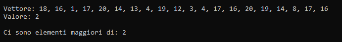

# Recursive search greater than a value

Implementazione ricorsiva dell'algoritmo di ricerca sequenziale che ritorna un booleano
se trova un valore maggiore del valore specificato.

## Componenti della ricorsione
1. **Condizioni di terminazione:** `if(n <= 0)`
2. **Istruzione di terminazione:** `return true`
3. **Passo di avvicinamento:** `n-1`
4. **Chiamata ricorsiva:** `if(maggiori_ele(v, n-1, ele) == false)`

## Utilizzo
1. Crea in Code::Blocks un nuovo progetto.
2. Copia il codice sorgente.
3. Compila ed esegui.

## Codice sorgente
```cpp
#include <iostream>
#include <ctime>

bool maggiori_ele(int v[], int n, int ele);

int main(){

    int lung_vett = 20;
    int vett[lung_vett];
    int elemento = 2;
    int val_min = 1;
    int val_max = 20;

    srand(time(NULL));

    std::cout << std::endl;
    std::cout << "\tVettore: ";

    for(int i = 0; i < lung_vett; i++){
        vett[i] = val_min + (rand() % (val_max - val_min + 1));
        if(i < lung_vett-1)
            std::cout << vett[i] << ", ";
        else
            std::cout << vett[i];
    }

    std::cout << std::endl;
    std::cout << "\tValore: " << elemento << std::endl;
    std::cout << std::endl;

    if(maggiori_ele(vett, lung_vett, elemento) == true){
        std::cout << "\tTutti gli elementi del vettore sono minori di: " << elemento;
        std::cout << std::endl;
    }else{
        std::cout << "\tCi sono elementi maggiori di: " << elemento;
        std::cout << std::endl;
    }

    return 0;
}

bool maggiori_ele(int v[], int n, int ele){
    if(n <= 0)                              // condizione di terminazione della ricorsione
        return true;

    if(maggiori_ele(v, n-1, ele) == false)  // chiamata ricorsiva + passo di avvicinamento
        return false;

    if(v[n-1] > ele)                        // risultato costruito a ritroso
        return false;

    return true;
}

```

## Output


## Autore
Gabriele Henriet - [GitHub](https://github.com/Gabri-dev-C)

## Licenza
MIT License

## Il mio approccio
Ho sviluppato questa soluzione che utilizza una ricorsione "bottom-up", 
controllando prima il risultato della ricorsione e poi l'elemento corrente.

Anche se esistono approcci più efficienti, questa versione rappresenta 
il mio ragionamento personale sul problema.
